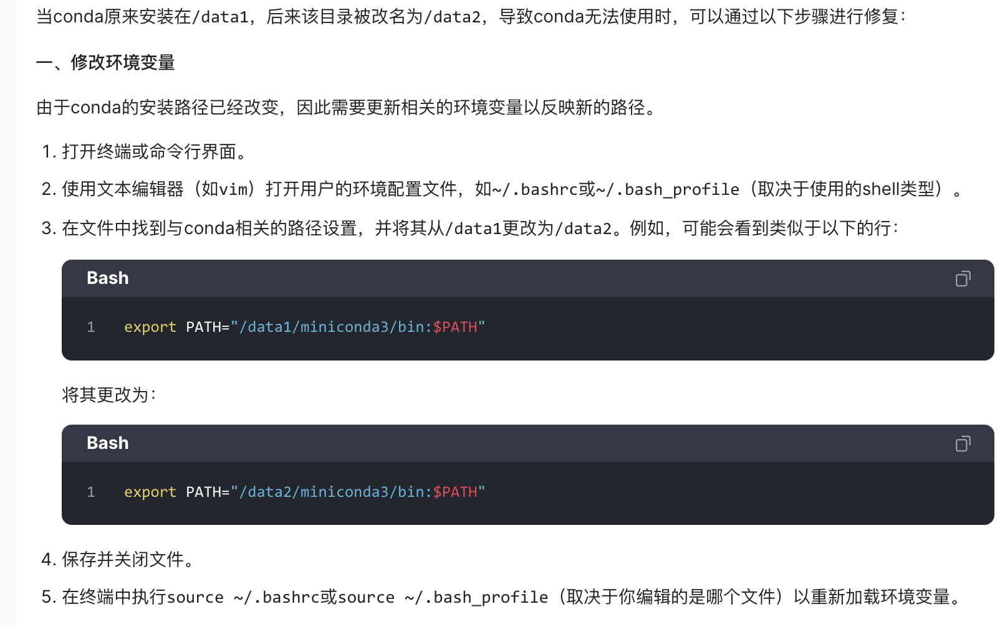
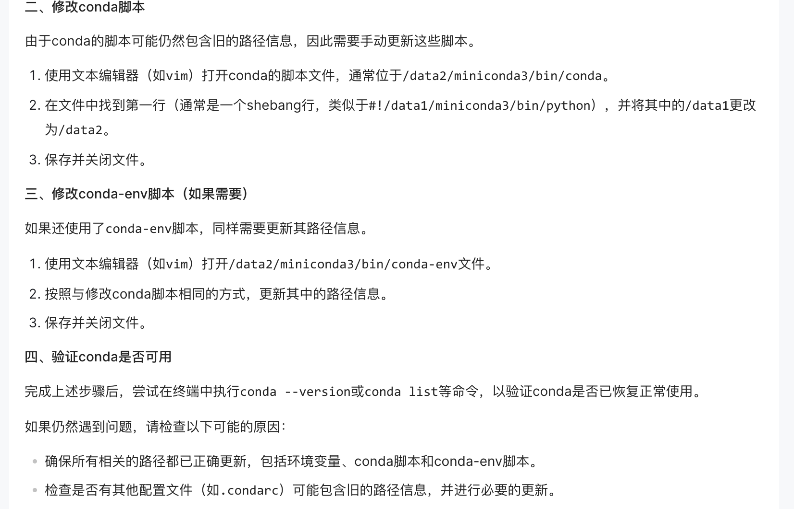

## 一、服务器中将用户的所有数据从一个节点迁移到另一个节点的时候，可能会导致用户的conda环境配置出现问题

### 1.1 首先，修改家目录下的.bashrc和conda.sh文件中的地址  

### 1.2 其次，在miniconda3/bin目录下搜索下列命令，全部修改 

    grep -rlI "/data01nfs/user/qinfsh" /path/to/directory/ | xargs sed -i 's|/data01nfs/user/qinfsh|/datanode02/qinfsh|g'  
### 1.3 修改miniconda3/etc/profile.d下的conda.sh等文件地址 

### 1.4 最后，使用source .bashrc

**具体操作可参考**：  

 

